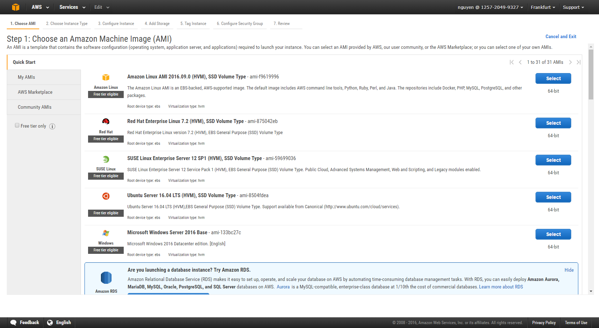
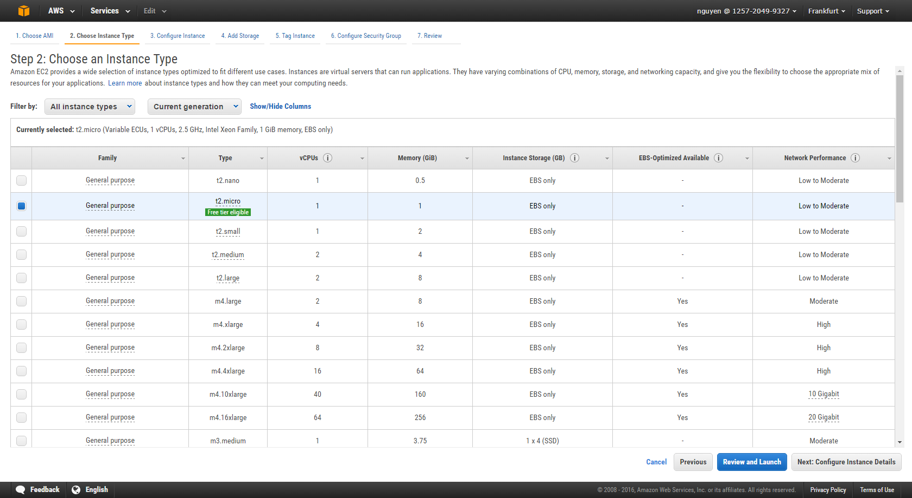

# Amazon Web Service - Server Setup

## Installation

Prerequisites: [Python 2 version 2.6.5+](https://www.python.org/downloads/) or [Python 3 version 3.3+](https://www.python.org/downloads/)

Install Amazon Command Line Interface

    $ pip install awscli            (Windows)
    $ sudo pip install awscli       (Linux, OS X, Unix)

## Configuration

Configure a profile, which is stored in the config and credentials files

*~/.aws/credentials*

    $aws configure --profile <PROFILENAME>

AWS Access Key ID | AWS Secret Access Key | Defail region name | Defaul output format

## Test profiles

    $ aws ec2 describe-instances --profile <PROFILENAME>

*~/.aws/credentials*

*~/.aws/config*

## Key Pairs & Security Groups

generate private key:

        $ openssl genrsa -out my-key.pem 2048

generate public key:

        $ openssl rsa -in my-key.pem -pubout > my-key.pub

import key:

        $ aws ec2 import-key-pair --key-name ec-courseAWSKeyPair --public-key-material “XYZ” --profile <PROFILENAME>

display key:

        $ aws ec2 describe-key-pairs --key-name ec-courseAWSKeyPair --profile <PROFILENAME>

create security group:

        $ aws ec2 create-security-group --group-name <GROUPNAME> --description "<DESCRIPTION>" --profile <PROFILENAME>

describe security group:

        $ aws ec2 describe-security-groups --group-names <GROUPNAME> --profile <PROFILENAME>

adding rules (RDP):

        $ aws ec2 authorize-security-group-ingress --group-name <GROUPNAME> --protocol tcp--port 3389 --cidr your.I.P.Adress/24 --profile <PROFILENAME>

Get your public IP address of your local computer using for example [this service](http://checkip.amazonaws.com/).

adding rules (SSH):

        $ aws ec2 authorize-security-group-ingress --group-name <GROUPNAME> --protocol tcp--port 22 --cidr your.I.P.Adress/24 --profile <PROFILENAME>

Using default AWS credentials:

        $ export AWS_ACCESS_KEY_ID=<YOURAWSACCESSKEY>
        $ export AWS_SECRET_ACCESS_KEY=<PUTINYOURAWSSECRETACCESSSKEY>

## Command Line Options

Profile:

        --profile <PROFILENAME> or default

Region:

        --region <AWSREGION>

Ouput:

        --output <OUTPUTFORMAT>

Endpoint: The endpoint to make the call against.

        --endpoint-url <ENDPOINT>

Example command:

        $ aws ec2 describe-instances --profile <NAME> --output json --region eu-central-1

### Command Structure

        $aws <command> <subcommand> [options and parameters]

## Launching Instance

### Amazon Machine Image (AMI)

"An AMI is a template that contains the software configuration (operating system, application server, and applications) required to launch your instance. You can select an AMI provided by AWS, our user community, or the AWS Marketplace; or you can select one of your own AMIs."

[Amazon Machine Image (AMI)](https://console.aws.amazon.com/ec2/)

For our application we choose the **Ubuntu Server 16.04**

### Instance Type

"Amazon EC2 provides a wide selection of instance types optimized to fit different use cases. Instances are virtual servers that can run applications. They have varying combinations of CPU, memory, storage, and networking capacity, and give you the flexibility to choose the appropriate mix of resources for your applications."

For our application we choose the **t2.micro** type.

[Information](https://aws.amazon.com/de/ec2/instance-types/) about choosing the right EC2 Instance Type for your needs.

### Create

    $ aws ec2 run-instances --image-id <IMAGE ID> --count 1 --instance-type <INSTANCETYPE> --key-name <KEYPAIRNAME> --security-groups <SECURITYGROUPNAME>

for example:

    $ aws ec2 run-instances --image-id ami-26c43149 --count 1 --instance-type t2.micro --key-name <KEYPAIRNAME> --<SECURITYGROUPNAME>

#### Adding a Name Tag

    $ aws ec2 create-tags --resources <RESOURCE> --tags Key=<NAME>,Value=<VALUE>

#### Adding a [Block Device Mapping](http://docs.aws.amazon.com/AWSEC2/latest/UserGuide/block-device-mapping-concepts.html)

"Each instance that you launch has an associated root device volume, either an Amazon EBS volume or an instance store volume. You can use block device mapping to specify additional EBS volumes or instance store volumes to attach to an instance when it's launched."

For example:

    $ aws ec2 run-instance … --block-device-mappings "[{\"DeviceName\":\"/dev/sdf\",\"Ebs\":{\"VolumeSize\":20,\"DeleteOnTermination\":false}}]"

### Find

    $ aws ec2 describe-instances --filters "Name=instance-type,Values=t2.micro”

### Shut-down 

    $ aws ec2 stop-instances --instance-ids <RESOURCE>

### Connect (SSH/PuTTY/MindTerm)

pre: ssh client | AWS CLI | instance ID | public DNS name | private key | enable inbound SSH

pre lock your private key:

    $ chmod 400 ecAWSprivateKey.pem

connect:

    $ ssh –i /<pathToPrivateKey>/<PrivateKeyFile> user_name@PublicDnsName

example:

    $ ssh -i .aws/ecAWSprivateKey.pem ubuntu@ec2-54-93-182-31.eu-central-1.compute.amazonaws.com

**Linux**: ec2-user **RHEL5**: root/ec2-user **Ubuntu**: ubuntu **Fedora**: fedora/ec2-user **SUSE Linux**: root/ec2-user

transfer:

    $ scp -i /path/my-key-pair.pem /path/SampleFile.txt ec2-user@ec2-198-51-100-1.compute-1.amazonaws.com:~

### Terminate

    $ aws ec2 terminate-instances --instance-ids <RESOURCE>

